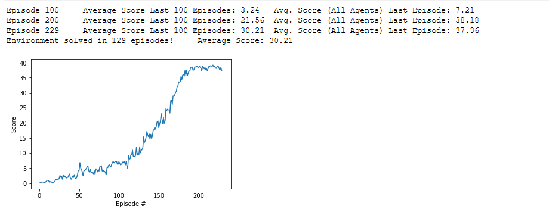

# DEEP-RL_Continuous_Control

In this project, we build a reinforcement learning (RL) agent that controls a robotic arm within Unity's [Reacher](https://github.com/Unity-Technologies/ml-agents/blob/master/docs/Learning-Environment-Examples.md#reacher) environment. The goal is to get 20 different robotic arms to maintain contact with the green spheres.
This project utilised the DDPG (Deep Deterministic Policy Gradient) architecture outlined in the [DDPG-Bipedal Udacity project repo](https://github.com/udacity/deep-reinforcement-learning/tree/master/ddpg-bipedal).

## State and Action Spaces
In this environment, a double-jointed arm can move to target locations. A reward of +0.1 is provided for each step that the agent's hand is in the goal location. Thus, the goal of your agent is to maintain its position at the target location for as many time steps as possible.

The observation space consists of 33 variables corresponding to position, rotation, velocity, and angular velocities of the arm. Each action is a vector with four numbers, corresponding to torque applicable to two joints. Every entry in the action vector must be a number between -1 and 1.

## Learning Algorithm

The agent training utilised the `ddpg` function in the DDPG_Continuous_Control notebook.

It continues episodical training via the the ddpg agent until `n_episoses` is reached or until the environment tis solved. The  environment is considered solved when the average reward (over the last 100 episodes) is at least +30.0. Note if the number of agents is >1 then the average reward of all agents at that step is used.

Each episode continues until `max_t` time-steps is reached or until the environment says it's done.

As above, a reward of +0.1 is provided for each step that the agent's hand is in the goal location.

The DDPG agent is contained in [`ddpg_agent.py`](https://github.com/hortovanyi/DRLND-Continuous-Control/blob/master/ddpg_agent.py)

For each time step and agent the Agent acts upon the state utilising a shared (at class level) `replay_buffer`, `actor_local`, `actor_target`, `actor_optimizer`, `critic_local`, `criticl_target` and `critic_optimizer` networks.

### DDPG Hyper Parameters
- n_episodes (int): maximum number of training episodes
- max_t (int): maximum number of timesteps per episode
- num_agents: number of agents in the environment

Upon running this numerous times it became apparent that the environment would return done at 1000 timesteps. Higher values were irrelevant.

### DDPG Agent Hyper Parameters

- BUFFER_SIZE (int): replay buffer size
- BATCH_SIZ (int): mini batch size
- GAMMA (float): discount factor
- TAU (float): for soft update of target parameters
- LR_ACTOR (float): learning rate for optimizer
- LR_CRITIC (float): learning rate for optimizer
- WEIGHT_DECAY (float): L2 weight decay
- N_LEARN_UPDATES (int): number of learning updates
- N_TIME_STEPS (int): every n time step do update

### Neural Networks

The Actor networks utilised two fully connected layers with 256 and 128 units with relu activation and tanh activation for the action space. The network has an initial dimension the same as the state size.

The Critic networks utilised two fully connected layers with 256 and 128 units with leaky_relu activation. The critic network has  an initial dimension the size of the state size plus action size.

## Plot of rewards

## Ideas for Future Work

- Experiment with other algorithms — Tuning the DDPG algorithm required a lot of trial and error. Perhaps another algorithm such as Trust Region Policy Optimization (TRPO), [Proximal Policy Optimization (PPO)](Proximal Policy Optimization Algorithms), or Distributed Distributional Deterministic Policy Gradients (D4PG) would be more robust.
- Add prioritized experience replay — Rather than selecting experience tuples randomly, prioritized replay selects experiences based on a priority value that is correlated with the magnitude of error. This can improve learning by increasing the probability that rare and important experience vectors are sampled.
